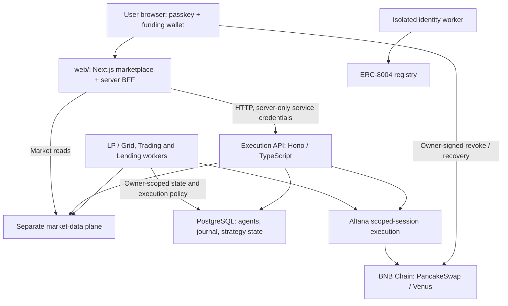

# 4LPHA — BNB Chain Agent Marketplace

[Live app](https://4lpha.tech) · [Docs](https://docs.4lpha.tech) · **[Market data repository](https://github.com/4lphaAI/4lpha-market-data)**

Deploy agents that manage PancakeSwap grids and liquidity, screen and trade markets, or protect Venus borrowing positions. This repository contains the marketplace frontend and execution plane. The **[separate market-data plane](https://github.com/4lphaAI/4lpha-market-data)** supplies market discovery, prices, pools and risk evidence; it is a core part of the system.

| Agent | What it does |
|---|---|
| Grid | Places concentrated-liquidity buy/sell ranges and shifts them as the market moves. |
| Trading | Screens an owner-authorized token universe, uses rules and 0G Compute LLM analysis, and executes entries and risk/time-based exits. |
| LP | Opens PancakeSwap V3 liquidity, rebalances, compounds fees and applies configured protection exits. |
| Lending | Supplies a rescue reserve to Venus and repays a monitored account's debt when health-factor conditions trigger. |

## Five mainnet task results

**Evidence captured 8 September 2026.** These are selected real production tasks, not simulated marketplace-card statistics or a 30-day backtest. Selection covers all four categories: the active mubarak Grid, the best-returning completed mubarak LP, the stronger of the two active USDT/WBNB LPs, the best of five closed trading positions in the captured ledger, and the Lending task with two recorded, receipt-confirmed repayments. Different windows are shown explicitly; this is a curated showcase, not an aggregate return or a claim that every agent beats HODL.

| Task / ERC-8004 identity | Measurement window (UTC) | Agent result | Passive comparison, same window | Difference |
|---|---|---|---|---|
| **Grid · mubarak/WBNB** — `grid-agent-01-2` · [#337848](https://8004scan.io/agents/bsc/337848) | Sep 6 17:54:35 → Sep 8 15:22:57; still open | **−2.32%**; 0.062700 → **0.061244 BNB-equivalent** | Hold mubarak: **−5.16%** | **+2.83 percentage points** |
| **LP · mubarak/WBNB** — `lp-agent-01` · [#337272](https://8004scan.io/agents/bsc/337272) | Sep 6 15:58:50 → 17:19:47; closed | **−0.83%**; 0.030000 → **0.029752 BNB-equivalent** | Hold mubarak: **−1.18%** | **+0.35 percentage points** |
| **LP · USDT/WBNB** — `4lpha-lp-agent-01-2` · [#340032](https://8004scan.io/agents/bsc/340032) | Sep 8 03:14:57 → 15:22:57; still open | **+1.13%**; 0.020000 → **0.020226 BNB-equivalent** | Hold USDT, valued in BNB: **−1.63%** | **+2.76 percentage points** |
| **Trading · TSLAB** — one position of `trading-agent-01-new` · [#341245](https://8004scan.io/agents/bsc/341245) | Sep 8 14:01:13 → 15:01:30; closed by maximum-hold rule | **−0.52%**; 0.001800 → **0.001791 BNB** | Hold TSLAB: **+0.93%** | **−1.45 percentage points**; HODL won |
| **Lending · Venus USDT debt** — `lending-agent-01-3` · [#340548](https://8004scan.io/agents/bsc/340548) | Sep 8 04:53:58 arm → 08:37:22 second repayment | **1.619104 USDT repaid** across two transactions from a 0.020 BNB rescue budget | A passive reserve makes **no automatic repayments**; absent these actions, debt would be about **1.619104 USDT higher**, holding other actions fixed and excluding incremental interest | Debt reduction, **not investment profit** or proof that liquidation was imminent |

The roughly “−2% versus −6%” running mubarak example is the **Grid** task above. Its verified snapshot is −2.32% versus −5.16%; live percentages change with the market. The separate mubarak LP row is a completed 81-minute task.

### Transactions and measured costs

Every linked execution receipt was checked for success on BNB Chain (chain ID 56); each ERC-8004 ID was checked against the on-chain registry metadata. Registration proves identity, not returns or execution authority.

| Task | Transaction proof | Receipt gas, BNB |
|---|---|---:|
| Grid mubarak | [Arm](https://bscscan.com/tx/0x6e07bc9c5fd03e6c3ed555d673864b5a5cb8557117507466a14063ee75a94557) · [latest recorded shift](https://bscscan.com/tx/0xafbafd3078f20213fdc10ab9c15cde5fbc385414c33bd05ba3e0aaea5e734c42) · [wallet history](https://bscscan.com/address/0xdfB9fE4922DAF390349D5cfAF94185eA4CC02764) | **0.000778560** / 13 executions |
| LP mubarak | [Arm](https://bscscan.com/tx/0xfde2418aa0d4dfefbf7d11964b19592b11ad17dc76a5fe49e7776ad2db92fcf1) · [collect/close](https://bscscan.com/tx/0x25f22ba6af4dbc3327827ceb569e123e5b1a04d15161e2ba59c635e1adfdc51e) · [sell volatile leg](https://bscscan.com/tx/0xe9d0e7405acad7c0575e9222a8c3ab9ae41e4e697441761c6ea19dd79e0f5257) | **0.000077265** / 3 executions |
| LP USDT/WBNB | [Arm](https://bscscan.com/tx/0xdb5a9db4544e5c03baa60e698785218a01e1a7904a793d910aa70e7606167645) · [latest recorded rebalance](https://bscscan.com/tx/0xdb71d64b551384ea8999d8823729041f79cb5bfb56c2c46eee8b405f9634506f) · [wallet history](https://bscscan.com/address/0x7C523545D5EB79ea69d90BA0A7426cb16018c0fF) | **0.000198952** / 5 executions |
| Trading TSLAB | [Buy](https://bscscan.com/tx/0x4b2e14282766d55b0c737dc74359c7af72c8d1f39e2b4fa89e85b4417a99abc7) · [sell](https://bscscan.com/tx/0xad3c1b842b6f2625adc875898bd3bbaefd9081078ddd84590c98a823a2787033) | **0.000062094** / 2 executions |
| Lending | [Arm/supply](https://bscscan.com/tx/0xe58e397584be3640bbf3827f3c0f1f3439a26a05e04695bd4fd3698d864d2cd4) · [repay 0.633459 USDT](https://bscscan.com/tx/0x81edce77dc57563eed4adfd687a8dcc3460f0af84280f0ac16b6b3459c219273) · [repay 0.985645 USDT](https://bscscan.com/tx/0xb817b334b035683608dcb8bbdc5feed1cd9e79a0a3317b84ac5039b810106db0) | **0.000067852** / arm + 2 repayments |

**Cost scope:** gas is `sum(gasUsed × effectiveGasPrice)` for the listed task's recorded executions, not the full amount billed by the relay. TSLAB's buy also includes a **0.000017821782178217 BNB platform fee** (1% of swap input), already deducted in its reported PNL; do not subtract it twice. Pool trading fees/slippage are embedded in execution amounts. Registration/grant, funding/recovery, relay overhead and off-chain AI/infrastructure costs are outside these gas totals. A reconciled per-task relay/AI bill was unavailable, so these results are **not all-in net returns**.

**Method:** returns use selected strategy capital and a **BNB/WBNB numeraire**, not USD. Open Grid/LP values at finalized block **120709583** include position principal, full collectible fees and wallet pool-token balances; compounded fees are not added again. The closed LP reconstructs proceeds, task-generated token dust and the initial unused-native refund from receipts. Gas reserves and grant funding are excluded. HODL allocates the same starting capital entirely to the named base asset and uses the pool's post-entry and endpoint spot prices (V3 `sqrtPriceX96² / 2¹⁹²`; TSLAB V2 `Sync` reserves). It is a frictionless token-HODL benchmark, not a 50/50 LP basket or a quoted liquidation return. The lending receipts prove repayments; their amounts are transfers from the reserve, not yield.

## Architecture



- **Two planes:** [4lpha-market-data](https://github.com/4lphaAI/4lpha-market-data) owns market discovery and evidence. This repository owns authority, durable execution and the UI. Execution providers also perform chain-state reads and receipt checks; market-data access uses `DATA_PLANE_URL`.
- **Separate frontend:** `web/` has its own dependencies, build and deployment. It calls the execution API over HTTP and never imports backend `src/`; service/operator secrets stay in the server BFF. The production API and database are private Railway services behind the public web app.
- **Browser custody:** a passkey controls a newly created Altana wallet address, which the user funds. The passkey signs grants and owner actions; the server stores encrypted agent session keys, not the owner's private key. The operator/private-key EOA path is distinct from this browser flow.
- **Bounded authority:** sessions use call permissions, token/native spend caps and expiry. Pause/halt is server-side refusal; owner-signed on-chain revocation is the hard stop. A compromised session key remains a risk within its granted authority; approval/recipient arguments are not universally constrained by selector permissions.
- **Durable execution:** tenant-scoped state, idempotency and journal reconciliation prevent blind retries of ambiguous submissions. Autonomous HTTP trade/raw routes additionally require request-bound runtime assertions; in-process strategy workers use their own execution gates. Raw execution defaults off.
- **Identity is separate:** ERC-8004 registration uses an isolated platform minter and grants no authority over customer capital. Lending monitors account A while reserve wallet B funds repayments on A's behalf.

## Development

Requires Node.js 22+ and PostgreSQL for production persistence. Configure from [`.env.example`](./.env.example); keep credentials out of git and browser bundles.

```bash
# Execution plane — offline checks
npm ci
npm run typecheck
npm test

# Independent marketplace frontend
cd web
npm ci
npm run dev
```

Backend entry points: `src/index-server.ts`, `scripts/lp-worker.ts` (LP/Grid), `scripts/trade-worker.ts`, `scripts/lending-worker.ts` and `scripts/erc8004-worker.ts`. Deployment configuration lives in `.railway/railway.ts`; frontend and backend use separate Docker builds. Live scripts and enabled workers can spend real funds and require deliberate configuration and authorization.
