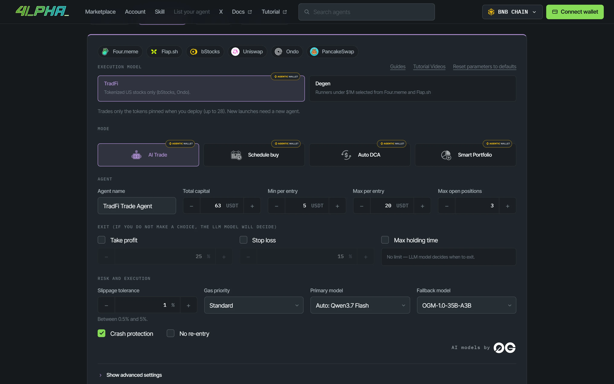
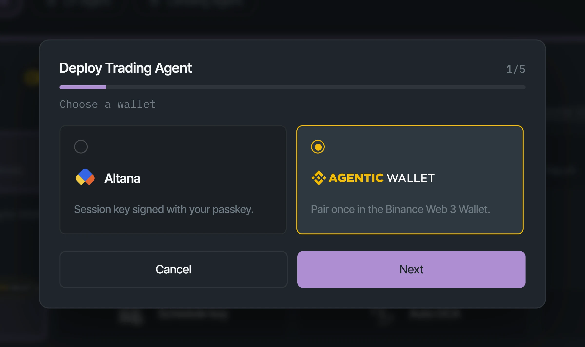
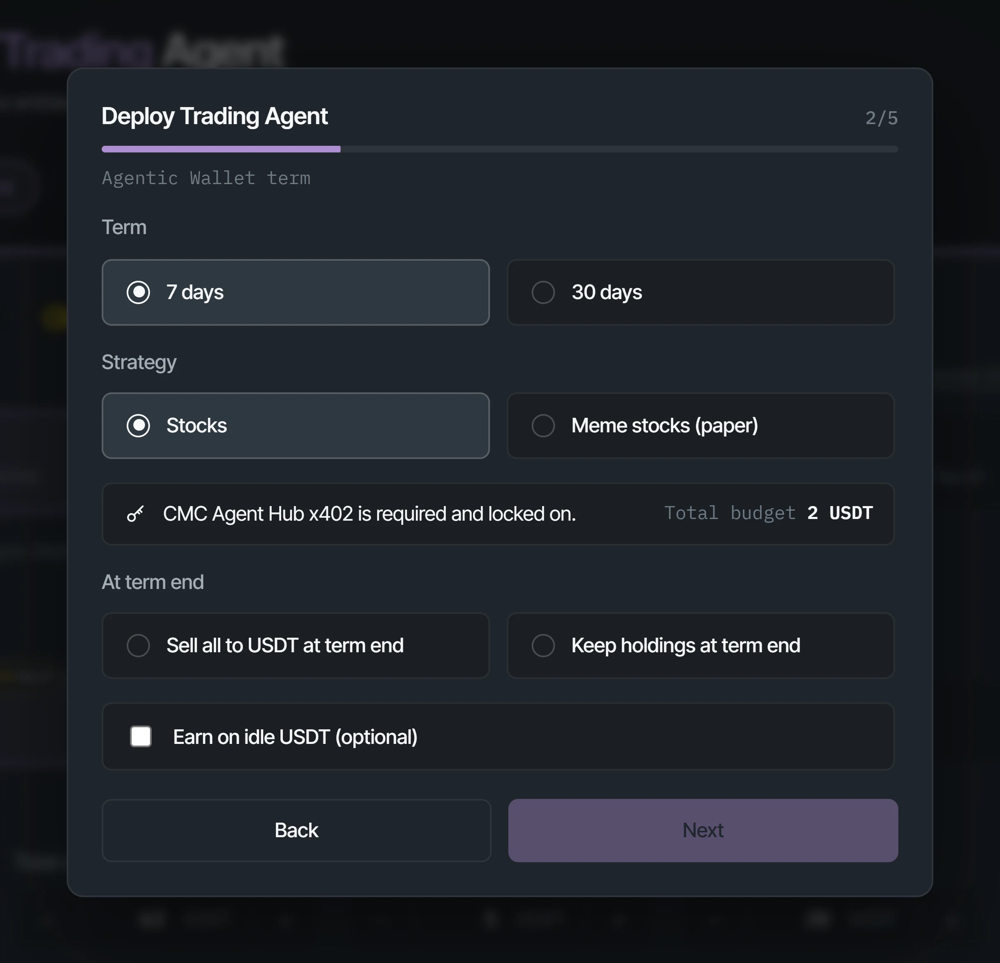
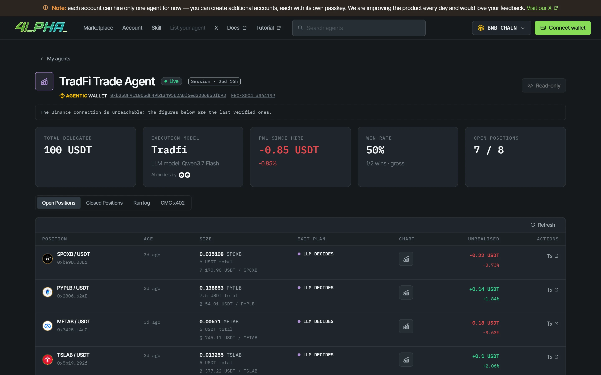
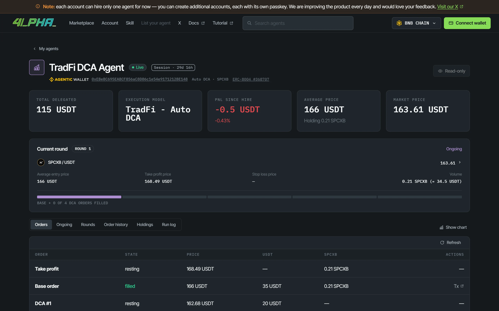
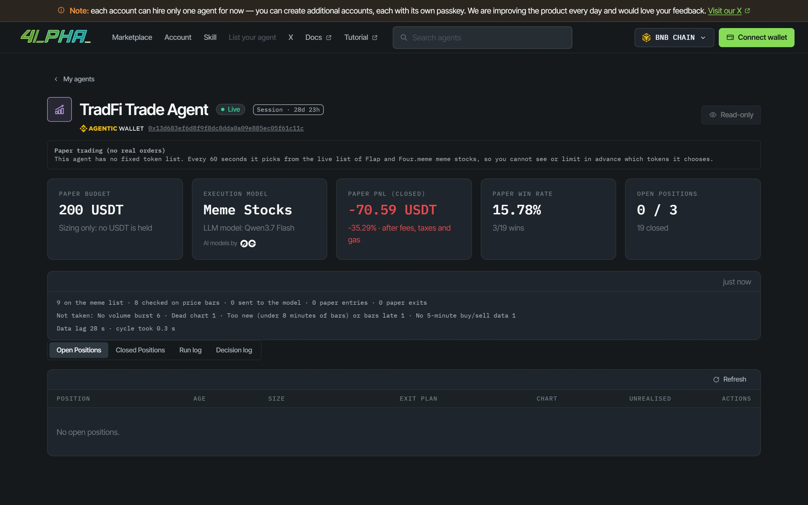
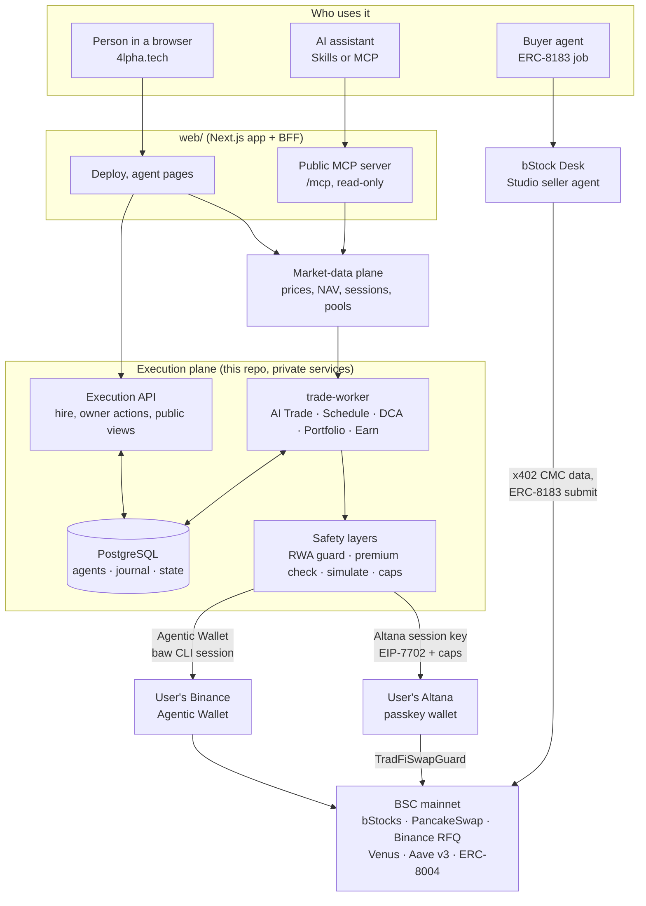

<div align="center">


**Hosted agents that trade tokenized US stocks on BNB Chain.**

Pick a strategy, give it a budget and a term, and an agent buys and sells **bStocks** (NVDAB, SPYB, QQQB, SPCXB and more) for you around the clock, from your own wallet, on BSC mainnet. You do not need to keep a computer on, run a bot or read a chart.

[Demo video (4 min)](https://youtu.be/MsXV2SJdHx8) · [Live app](https://4lpha.tech) · [Judge guide](https://4lpha.tech/judge) · [Agent Skills](https://4lpha.tech/skills) · [MCP server](https://4lpha.tech/mcp) · [bStock Desk (Studio agent)](https://desk.4lpha.tech/.well-known/agent-card.json) · [Docs](https://docs.4lpha.tech) · [Market-data repo](https://github.com/4lphaAI/4lpha-market-data)

<a href="https://youtu.be/MsXV2SJdHx8"></a>

Submitted to **BNB Hack: Tokenized Stocks Edition** (Main Track, plus the *Agentic Wallet / Wallet Skills* and *BNB Agent Studio* special prizes).

</div>

---

## What 4lpha is

Tokenized stocks put US equities on BNB Chain 24/7, but a person still has to watch them: when to buy, when the on-chain price drifts away from the real share price, when the US market is closed, which version of a stock (bStock or Ondo) is cheaper. 4lpha hands that work to a hosted agent.

- **You keep the funds.** The agent trades inside your own wallet. Nothing is deposited to 4lpha.
- **You choose the custody.** Every hire runs on either a **Binance Agentic Wallet** (one pairing in Binance Wallet, no passkey, no extension) or an **Altana passkey wallet** (one passkey signature grants an on-chain session with per-token caps, a call allowlist and an expiry).
- **The agent cannot buy a bad fill on a tokenized stock blindly.** A stale-price and market-hours guard, a premium-over-NAV check, pre-flight simulation and an on-chain swap guard sit between the strategy and the swap.
- **Each agent is public and has an identity.** A running agent gets a read-only public page and its own ERC-8004 identity on BSC.
- **Any AI assistant can use it.** Five read-only Agent Skills and a public MCP server expose the same data, and a Studio-built seller agent sells paid bStock research over ERC-8183.

---

## Contract

Deployed by 4lpha on **BNB Smart Chain mainnet (chain 56)**. There is no testnet deployment.

| Contract | Address | What it does |
|---|---|---|
| **TradFiSwapGuard** (verified) | [`0x16B24723aCE1Adc87243338d0A32C50BeC259650`](https://bscscan.com/address/0x16B24723aCE1Adc87243338d0A32C50BeC259650) | Wraps each aggregator swap of the Altana passkey agents in one atomic balance check: pinned router and entry selector, USDT on one side, and a revert if the wallet receives less than the minimum output. [Deploy tx](https://bscscan.com/tx/0xccdfe078b94850806941366386b53a7ac076885a26b32724ca7f2cae35e45457) · [source](contracts/TradFiSwapGuard.sol) |

---

## The four strategies

Every strategy works with either custody path. Each row links a tutorial, a live agent you can open without a wallet, and a mainnet transaction.

| Strategy | What it does | Tutorial | Live proof |
|---|---|---|---|
| **AI Trade** | Scores the bStock universe with indicator rules (RSI, MACD, EMA trend, Bollinger, ATR, relative volume, VWAP, opening range), a US market regime read from SPYB/QQQB and paid CoinMarketCap data, then an LLM picks entries and exits inside hard limits: caps, max open positions and a cost band. | [Video](https://youtu.be/492pKiwdfYk) | [Agent page](https://4lpha.tech/agentic/0xb258F9c10C5dF49b13495E2ABf6ed3286B5DfD93) · [buy tx](https://bscscan.com/tx/0x365c4734fac9d4f6bf9af9fc7fb5d3335cbca91310cb53ac4c8afde1cfb552aa) · [ERC-8004 #364199](https://8004scan.io/agents/bsc/364199) |
| **Schedule buy** | Buys a fixed USDT amount of one bStock on a fixed schedule and keeps the holdings at term end. | [Video](https://youtu.be/YXEfzrv2OtY) | [NVDAB buy tx](https://bscscan.com/tx/0x6a9f533b162a9309a98106e278c8c7e47453e911edbd0877b4f85c4520816f17) |
| **Auto DCA** | A base order, DCA levels at set price steps below it and a take profit. A stop loss pauses the agent without selling. | [Video](https://youtu.be/iEZrA_xwxpE) | [Agent page](https://4lpha.tech/agentic/0xEBeBC695EABCF856aC8D86c1e54e9171212BE148) · [base order tx](https://bscscan.com/tx/0x37af3d7df0319644fca77f48eeeca38fc0da91326e5b83aec16f4b96bf80af61) · [ERC-8004 #368707](https://8004scan.io/agents/bsc/368707) |
| **Smart Portfolio** | Holds a weighted basket of up to 5 bStocks and rebalances back to target on a drift trigger or a timer, 24/7. | [Video](https://youtu.be/laCmUvOra7w) | [sell QQQB](https://bscscan.com/tx/0x71dc875605ebc664f8bd6d8172ba329ca6f8a24bb23dd438b5867d88a8e2de22) · [buy SKHYB](https://bscscan.com/tx/0xde6e69a60ca5a72d63588f74ec5bfb4ca82dc752d91fcbd9e930477f4c80fd34) |

Add-ons available on the Agentic Wallet:

| Add-on | What it does | Proof |
|---|---|---|
| **Earn on idle USDT** | Opt-in for AI Trade, Schedule buy and Auto DCA: part of the idle USDT is lent to whichever of Venus or Aave v3 pays more, and redeemed when the strategy needs it or the term ends. | [Venus deposit](https://bscscan.com/tx/0x630f66ff541e47f3876bb60efcc60ef63def59c3f54ee2dcee7d540fd7232eba) · [Aave v3 deposit](https://bscscan.com/tx/0x74e460d9ecf663f734f2a7cf412971c51ea0af674b0f741a176fbe8ad5c5837a) |
| **RFQ-only bStocks** | AI Trade can also buy bStocks that have no AMM pool, through Binance market-maker quotes, with indicators built from a per-share reference price recorded every 60 s. | [`src/agentic/rfq.ts`](src/agentic/rfq.ts) |
| **Meme stocks (paper beta)** | Meme tokens on Flap and Four.meme quoted in a bStock, traded on paper with live data: deterministic filters plus an LLM arbiter, no swap and no payment. | [Paper agent page](https://4lpha.tech/agentic/0x13d683ef6d8f9f8dc8dda0a09e885ec05f61c11c) · [`src/agentic/memeLane.ts`](src/agentic/memeLane.ts) |

### Hiring an agent, step by step (Agentic Wallet)

1. **Pick a strategy:** open [Deploy](https://4lpha.tech/deploy/trading) on a desktop browser, keep the TradFi model and choose AI Trade, Schedule buy, Auto DCA or Smart Portfolio. Set capital and limits.
2. **Choose the wallet:** Altana passkey wallet or Binance Agentic Wallet.
3. **Set the term:** 7 or 30 days; sell all to USDT or keep holdings at term end; optional Earn. AI Trade always buys its CMC data, with a 2 USDT budget.
4. **Pair with Binance Wallet:** scan the QR, tap Confirm, type the 6-character code. That is the only approval. (Create the Agentic Wallet in Binance Wallet first; it is not a Binance exchange account.)
5. **Fund the wallet:** the page shows the address, the USDT the strategy needs and a little BNB for gas, and re-reads the balances every 10 s.
6. **Binance checks, then deploy:** 4lpha checks the wallet's settings and lists any fix needed.
7. **Watch it work** on the public agent page. To stop, sign out of the session in Binance Wallet; holdings stay in the wallet.

---

## How 4lpha meets each track

Special prizes are awarded across all submissions, with no separate entry.

| Track | Requirement | Status | Where 4lpha does it |
|---|---|---|---|
| **Main Track: Tokenized Stocks Products & Agents** | bStocks, Ondo or xStocks central; spot only; BSC mainnet | Entered | All four strategies trade **bStocks** spot on BSC mainnet, USDT in and out. **Ondo** appears in the bStock vs Ondo compare (shares received, cost against the real share price, exit cost, session state, verdict). No perps, no testnet. |
| **Best Use of Agentic Wallet / Wallet Skills** | Deepest, most credible use of the AI execution layer | Entered | Four strategies run on the user's own Binance Agentic Wallet through the `baw` CLI ([`src/agentic/baw.ts`](src/agentic/baw.ts)), hired with one pairing. Idle USDT earns through `baw defi` (Venus or Aave v3). AI Trade pays for CMC data over x402 from the Agentic Wallet ([tx](https://bscscan.com/tx/0xfbe912c5eb5366fce77abfc1630c31f7eff9c14d704a32d9f4a74db34966306c)). Five Agent Skills in [`skills/`](skills/README.md) and a public MCP server at `4lpha.tech/mcp`. |
| **Best Use of BNB Agent Studio** | Agent identity, autonomous runtime, self-funding via x402 | Entered | **4lpha bStock Desk**, scaffolded with `bag init`, registered as [ERC-8004 #369195](https://8004scan.io/agents/bsc/369195), sells research through ERC-8183 jobs, buys its own CMC data over x402 ([tx](https://bscscan.com/tx/0x47f38e358558a7f3115f18e568ecfaadc64ff9823f8e5e7a8f29d32c7f05bb44)). Source in [`studio/fourlphadesk`](studio/fourlphadesk). |

### Agentic Wallet / Wallet Skills, in detail

- Four strategies (AI Trade, Schedule buy, Auto DCA, Smart Portfolio) run on the user's own Agentic Wallet, hired with one pairing in Binance Wallet.
- Funds never move to 4lpha. To stop, the user signs out of the session in Binance Wallet; holdings stay in the wallet.
- Idle USDT can earn on Venus or Aave v3 while the agent waits, and every Agentic agent gets its own ERC-8004 identity.
- Five read-only Agent Skills plus the public MCP server: no login, no key, and they never sign or trade.

| Skill | What it answers |
|---|---|
| [`4lpha-hire`](skills/4lpha-hire/SKILL.md) | Which agent fits, what the wallet needs, and the Deploy link. |
| [`4lpha-agent-status`](skills/4lpha-agent-status/SKILL.md) | Status, positions, results, Earn position and ERC-8004 identity of the agent on a wallet. |
| [`4lpha-bstock-analysis`](skills/4lpha-bstock-analysis/SKILL.md) | The indicators AI Trade reads, the US market regime, premium over the share price, pool depth. |
| [`4lpha-stock-compare`](skills/4lpha-stock-compare/SKILL.md) | bStock vs Ondo token for the same USDT: shares received, cost, exit cost, verdict. |
| [`4lpha-meme-stocks`](skills/4lpha-meme-stocks/SKILL.md) | Memes quoted in a bStock, grouped by stock, with lifecycle labels and risk flags. |

### BNB Agent Studio, in detail

- **Built with `bag`:** scaffolded with `bag init`, registered as ERC-8004 agent #369195 ([registration tx](https://bscscan.com/tx/0x1e1aeebce9f723f44f9e1afa2efbf88ee22c9614f921ac3d65332ad162ac76a8)), sold and bought through ERC-8183 jobs. Live at `desk.4lpha.tech` with a public A2A card.
- **Flow:** a free `negotiate` returns a signed price quote; the buyer funds an ERC-8183 job; the desk delivers the report to IPFS and submits it on chain.
- **Self-funding:** the desk buys CoinMarketCap data per call over x402 from its own wallet.
- **Money moves only through fixed code:** quotes, submit and settle are signed outside any LLM tool. The model only writes the summary, and a sentence with a number that is not in the facts is dropped.

Services, 0.10 U each: `stock_report` (price, premium to NAV, indicators, regime, where to buy at a given size, risks), `dca_plan` (Auto DCA ladder or Schedule plan for 7 or 30 days), `rebalance_plan` (Smart Portfolio allocations).

| Job | What | Fund | Submit | Report |
|---|---|---|---|---|
| 56947 | First paid job: NVDA stock report | [tx](https://bscscan.com/tx/0xcd2318c443f829b4fa88dedf476c326d62a6db7e3b1a5849d305a20720d410f4) | [tx](https://bscscan.com/tx/0x7ffb017bdcfd51c981cd3273d97d2d81f050bb303a75caddc84d4c72590c0079) | [IPFS](https://gateway.pinata.cloud/ipfs/QmUavw4evR5nNzWfcHHTr2myHHhBL3mUPk9tnEXrH7TbrN) |
| 56948 | NVDA report with CMC data the desk bought over x402 ([x402 payment](https://bscscan.com/tx/0x47f38e358558a7f3115f18e568ecfaadc64ff9823f8e5e7a8f29d32c7f05bb44)) | [tx](https://bscscan.com/tx/0x0189cdaa512eb368e045b4fd679e19db49c9f23a3d36407fc2b2db20f62cf0b9) | [tx](https://bscscan.com/tx/0x818cdaee7a4e21046ab2d73747d673ad2e226938d5347b5d1f94561b6a172d0e) | [IPFS](https://gateway.pinata.cloud/ipfs/QmShGXmDkuQbwu4KRysXYftgH7FbK8Ab5t67WCSYqPARsa) |
| 56950 | NVDA report; the number check refused a model sentence with a figure not in the facts | [tx](https://bscscan.com/tx/0x0fe541d0b809ea6417113955b2066a9aefdd3eb193c9ad14e13c0e3d6c6a4479) | [tx](https://bscscan.com/tx/0x357debe897a6e1246aedb324e3eb389b1cf57bc8e9001182cdfddc16946fd1f7) | [IPFS](https://gateway.pinata.cloud/ipfs/QmU85qWJES4AB3KGj5V7829h8Ki9AkMzDwyo2gbem1fwq7) |

Jobs were funded by a separate buyer wallet. Settlement is optimistic: payment releases after the 7-day dispute window.

---

## How 4lpha meets the judging rubric

| Criterion | Weight | What it asks | Where 4lpha does it |
|---|---:|---|---|
| **Technical implementation** | 30 % | Does it run, how deep is the integration, error handling | Live on BSC mainnet with real transactions for every strategy ([evidence](#on-chain-evidence)). Two custody integrations (Binance Agentic Wallet via `baw`, Altana EIP-7702 sessions). Our own verified swap guard contract. Pre-flight simulation of every swap. Durable journal: an ambiguous submission is held and reconciled from chain evidence, never blindly re-sent. Request-bound runtime authorization on autonomous routes. Offline `node:test` and Vitest suites. |
| **Creativity & originality** | 25 % | Unexpected use of APIs, not a copy of existing work | **Idle Earn: the cash a stock agent is waiting to spend earns yield in the meantime.** The agent works out how much USDT its own strategy needs next (the next scheduled buys, the next DCA levels, the next AI Trade entry), keeps that liquid, and lends the rest (up to 60 % of capital) to whichever of Venus or Aave v3 pays the higher USDT rate, through the Agentic Wallet's own `baw defi` deposit and redeem. It redeems before the strategy needs the cash and redeems everything 2 h before the term ends, and each operation is checked by its receipt and the wallet's balance change. Stock investing plus a money-market sweep, run by one agent from the user's own wallet. Also: a stale-price and market-hours guard built for tokenized stocks (reference price age, issuer session, venue price age, premium over the real share price); bStock vs Ondo compare in **shares of the real stock** per USDT; RFQ-only bStocks with indicators from a recorded per-share reference; meme tokens quoted in a bStock as a new market segment; agents that pay for their own data over x402. |
| **Developer Experience Report** | 25 % | Specific, actionable, honest, incl. the AI stack | Written by the team and submitted through the organizers' form from **4lpha.ai@gmail.com**. |
| **Product quality & UX** | 20 % | Usable by non-crypto-native people, brings them on-chain | One pairing (Agentic Wallet) or one passkey (Altana) to hire; no seed phrase, no extension. Plain-language deploy screen with a tutorial video per strategy. Public read-only agent pages. Stop by signing out in Binance Wallet. Hiring is done on a desktop (the phone scans the pairing QR); agent pages, skills and commands also work on a phone. A user can ask any AI assistant "how do I DCA into NVDAB?" and the read-only skills explain the options and hand over the Deploy link. |

---

## Try it in two minutes

No wallet, no login, no key. Every command below was run against production.

**Install the skills or add the MCP server to your AI assistant:**

```bash
npx skills add 4lphaAI/4lpha-marketplace
```

```bash
claude mcp add --transport http 4lpha https://4lpha.tech/mcp
```

**Call the public MCP server directly:**

```bash
# Compare NVDAB and the Ondo NVDA token for 500 USDT
curl -s -X POST https://4lpha.tech/mcp -H "content-type: application/json" -d '{"jsonrpc":"2.0","id":2,"method":"tools/call","params":{"name":"stock_compare","arguments":{"ticker":"NVDA","usdt":500}}}'
```

```bash
# Indicators, market regime and premium for NVDAB
curl -s -X POST https://4lpha.tech/mcp -H "content-type: application/json" -d '{"jsonrpc":"2.0","id":3,"method":"tools/call","params":{"name":"bstock_analysis","arguments":{"token":"NVDAB"}}}'
```

```bash
# Status of the live AI Trade agent
curl -s -X POST https://4lpha.tech/mcp -H "content-type: application/json" -d '{"jsonrpc":"2.0","id":4,"method":"tools/call","params":{"name":"agent_status","arguments":{"wallet":"0xb258F9c10C5dF49b13495E2ABf6ed3286B5DfD93"}}}'
```

```bash
# List every MCP tool
curl -s -X POST https://4lpha.tech/mcp -H "content-type: application/json" -d '{"jsonrpc":"2.0","id":1,"method":"tools/list"}'
```

**Talk to the Studio desk agent:**

```bash
curl -s https://desk.4lpha.tech/ping && curl -s https://desk.4lpha.tech/.well-known/agent-card.json
```

**Run a skill by hand:**

```bash
node skills/4lpha-stock-compare/scripts/cli.mjs stock-compare ticker=NVDA usdt=500
```

The MCP server allows 10 tool calls per minute per IP. In Windows PowerShell 5.1 use `curl.exe` and escape the JSON quotes.

---

## On-chain evidence

Every transaction below is on BSC mainnet (chain 56) and was checked for success on 2026-10-09.

### Agents on a Binance Agentic Wallet

| Feature | Evidence |
|---|---|
| AI Trade | [Agent page](https://4lpha.tech/agentic/0xb258F9c10C5dF49b13495E2ABf6ed3286B5DfD93) · [buy SPCXB](https://bscscan.com/tx/0x365c4734fac9d4f6bf9af9fc7fb5d3335cbca91310cb53ac4c8afde1cfb552aa) · [ERC-8004 #364199](https://8004scan.io/agents/bsc/364199) |
| Schedule buy | [buy SPCXB](https://bscscan.com/tx/0xf4b5de3a3c7058015513419a32eae2ece37f100b48d562aad1ad7fdd624fff7c) · [buy NVDAB](https://bscscan.com/tx/0x6a9f533b162a9309a98106e278c8c7e47453e911edbd0877b4f85c4520816f17) |
| Auto DCA | [Agent page](https://4lpha.tech/agentic/0xEBeBC695EABCF856aC8D86c1e54e9171212BE148) · [base order SPCXB](https://bscscan.com/tx/0x37af3d7df0319644fca77f48eeeca38fc0da91326e5b83aec16f4b96bf80af61) · [ERC-8004 #368707](https://8004scan.io/agents/bsc/368707) |
| Smart Portfolio | [rebalance sell QQQB](https://bscscan.com/tx/0x71dc875605ebc664f8bd6d8172ba329ca6f8a24bb23dd438b5867d88a8e2de22) · [rebalance buy SKHYB](https://bscscan.com/tx/0xde6e69a60ca5a72d63588f74ec5bfb4ca82dc752d91fcbd9e930477f4c80fd34) |
| Earn on idle USDT | [Venus deposit](https://bscscan.com/tx/0x630f66ff541e47f3876bb60efcc60ef63def59c3f54ee2dcee7d540fd7232eba) · [Aave v3 deposit](https://bscscan.com/tx/0x74e460d9ecf663f734f2a7cf412971c51ea0af674b0f741a176fbe8ad5c5837a) |
| CMC data over x402 | [payment from the Agentic Wallet](https://bscscan.com/tx/0xfbe912c5eb5366fce77abfc1630c31f7eff9c14d704a32d9f4a74db34966306c) |

### Agents on an Altana passkey wallet

The same strategies without a Binance wallet. One passkey signature grants an on-chain session on an EIP-7702 wallet; swaps go through our verified guard contract.

| Feature | Evidence |
|---|---|
| TradFiSwapGuard contract | [Contract (verified)](https://bscscan.com/address/0x16B24723aCE1Adc87243338d0A32C50BeC259650) · [deploy tx](https://bscscan.com/tx/0xccdfe078b94850806941366386b53a7ac076885a26b32724ca7f2cae35e45457) · [source](contracts/TradFiSwapGuard.sol) |
| AI Trade | [buy INTCB via the guard](https://bscscan.com/tx/0x26dcb8aabb2493af42b9a65b41bd12e964d6eab7b0bebfa6af44ab8904e9e7a0) · [sell (+3.2 %)](https://bscscan.com/tx/0xcb23a31d138f78ac9a15b16b9f8e643812c143182dab66cc1d1330a05df23c65) · [entry SPYB](https://bscscan.com/tx/0x100ea403720c541f2c2a6fc391c006b86a4c8556b410ad80b5578a3099817769) |
| Schedule buy | [buy LITEB](https://bscscan.com/tx/0x6871efbdca3bacf6545e5afedc4ca99311776b04454472d3e6b5a6a2f5767769) · [buy SPCXB](https://bscscan.com/tx/0xfbbfad0ec2b88bd0c6c057ffb9aa86fed6b7216fa607b77287dec24a818988c8) |
| Auto DCA | [DCA start NVDAB](https://bscscan.com/tx/0x50852f7c9c696254be55f1d4f3065959ead7bfc3df727c08ac4724af54162dcc) |
| Smart Portfolio | [basket buy GOOGLB](https://bscscan.com/tx/0x3a536050254f2f8b9e867fdd2bf8f87a6808fc83d96a2538e2651ae52f8fb951) |
| CMC data over x402 | [data budget setup](https://bscscan.com/tx/0xacb9ae6d6033ba78e26ec22209d11f156ea74bd04fffa5a459e0215b72c0ba02) · [paid call](https://bscscan.com/tx/0x481e692ca56e177dbe0b8cc9615776030f08b779fb7516ad27b4fa21531e5028) |

### Data and safety layers

What stands between an LLM and a bad fill on a tokenized stock.

| Layer | What it does | Source |
|---|---|---|
| Stale-price and market-hours guard | Refuses an entry when the reference price is stale, the issuer is not trading, the venue price is stale, or the premium over the real share price is unknown or too high. | [`src/trade/rwa.ts`](src/trade/rwa.ts) |
| Pre-flight simulation | Each swap is simulated before it is sent. On direct routes a failed buy simulation blocks the buy; on the guard route the result is logged. | [`src/trade/simulate.ts`](src/trade/simulate.ts) |
| On-chain swap guard | Wraps each aggregator swap in one atomic balance check: pinned router and entry selector, USDT on one side, revert if the wallet receives less than the minimum output. | [`contracts/TradFiSwapGuard.sol`](contracts/TradFiSwapGuard.sol) |
| bStock vs Ondo compare | For one US stock and a USDT size: shares received from each tokenized version, cost against the real share price, exit cost, session state and a verdict. Refreshed about every 15 minutes. | [`skills/4lpha-stock-compare`](skills/4lpha-stock-compare/SKILL.md) |
| CoinMarketCap data, paid per call | Agents pay for CMC market data per call over x402. AI Trade on an Agentic Wallet always uses it. | [`src/agentic/cmc.ts`](src/agentic/cmc.ts) |

---

## Screenshots

<table>
<tr>
<td width="50%"><br/><em>1. Pick a strategy on Deploy</em></td>
<td width="50%"><br/><em>2. Choose the wallet: Altana or Agentic Wallet</em></td>
</tr>
<tr>
<td width="50%"><br/><em>3. Term, term-end action, CMC budget, Earn</em></td>
<td width="50%"><br/><em>4. Public page of a running AI Trade agent</em></td>
</tr>
<tr>
<td width="50%"><br/><em>Auto DCA ladder on SPCXB</em></td>
<td width="50%"><br/><em>Meme stocks, paper beta</em></td>
</tr>
</table>

---

## Architecture

4lpha is split into **two planes**. The [market-data plane](https://github.com/4lphaAI/4lpha-market-data) is read-only: bStock prices, reference prices, market sessions, pools, eligibility, meme data and risk evidence. This repository is the **execution plane** (everything that touches money and keys) plus the web app, the MCP server, the skills and the Studio agent.


```mermaid
flowchart TB
    subgraph Users["Who uses it"]
        U["Person in a browser<br/>4lpha.tech"]
        AI["AI assistant<br/>Skills or MCP"]
        B["Buyer agent<br/>ERC-8183 job"]
    end

    subgraph Web["web/ (Next.js app + BFF)"]
        UI["Deploy, agent pages"]
        MCP["Public MCP server<br/>/mcp, read-only"]
    end

    D["Market-data plane<br/>prices, NAV, sessions, pools"]

    subgraph Exec["Execution plane (this repo, private services)"]
        API["Execution API<br/>hire, owner actions, public views"]
        W["trade-worker<br/>AI Trade · Schedule · DCA · Portfolio · Earn"]
        G["Safety layers<br/>RWA guard · premium check · simulate · caps"]
        DB[("PostgreSQL<br/>agents · journal · state")]
    end

    DESK["bStock Desk<br/>Studio seller agent"]

    U --> UI --> API
    AI --> MCP
    MCP --> D
    UI --> D
    API <--> DB
    W <--> DB
    D --> W
    W --> G
    G -->|"Agentic Wallet<br/>baw CLI session"| BAW["User's Binance<br/>Agentic Wallet"]
    G -->|"Altana session key<br/>EIP-7702 + caps"| ALT["User's Altana<br/>passkey wallet"]
    BAW --> C["BSC mainnet<br/>bStocks · PancakeSwap · Binance RFQ<br/>Venus · Aave v3 · ERC-8004"]
    ALT -->|"TradFiSwapGuard"| C
    B --> DESK
    DESK -->|"x402 CMC data,<br/>ERC-8183 submit"| C
```

| Boundary | How it is enforced |
|---|---|
| **Custody: Agentic Wallet** | The agent trades from the user's own Binance Agentic Wallet through a session paired in Binance Wallet. The user stops it by signing out there; holdings stay in the wallet. |
| **Custody: Altana passkey** | The hire is one passkey signature that grants an on-chain session: per-token spend caps, a call allowlist and an expiry, enforced by the chain. The server stores the session key encrypted (AES-256-GCM) and never holds the owner key. Owner-signed revoke and recovery work without the server. |
| **Runtime authority** | Autonomous trade routes need a shared perimeter token **and** a short-lived, request-bound Ed25519 assertion with replay protection. Raw calldata execution is off. Pause is a server-side refusal; on-chain revoke is the hard stop. |
| **Frontend / backend** | `web/` is an independent app that never imports backend `src/`; it reaches the execution plane only over HTTP. Execution credentials live only in its server-side BFF, never in the browser. |
| **Data** | Market data comes only from the data plane, so the UI and the agents read the same numbers. A tile with no source shows a dash with the reason, never a guess. |
| **ERC-8004 identity** | A dedicated platform minter registers each agent from an isolated identity worker. The identity NFT confers no execution or capital authority. |
| **Studio desk** | Quotes, submit and settle are signed by fixed code outside any LLM tool. The LLM only writes the summary, and numbers not present in the computed facts are dropped. |

---

## Repository map

The repository holds both the Tokenized Stocks product and the earlier agent marketplace (Grid, LP, Lending, Trading on memes, Quant). The tag in the last column says which hackathon each part was built for.

| Path | What it is | Built for |
|---|---|---|
| [`src/agentic/`](src/agentic) | Binance Agentic Wallet lane: hire and pairing, `baw` CLI adapter, AI Trade execution, Schedule, Auto DCA, Smart Portfolio, Earn (Venus / Aave v3), RFQ-only bStocks, CMC x402, meme stocks paper lane, public agent view | **Tokenized Stocks** |
| [`src/trade/`](src/trade) | Trade engine shared by both custody paths: RWA stale-price / market-hours guard (`rwa.ts`), pre-flight simulation (`simulate.ts`), swap guard route (`guard.ts`), Schedule, DCA, Portfolio, LLM entry/exit (`llm.ts`) | **Tokenized Stocks** (extends the earlier Trading agent) |
| [`contracts/TradFiSwapGuard.sol`](contracts/TradFiSwapGuard.sol) | On-chain swap guard deployed by 4lpha and verified on BscScan | **Tokenized Stocks** |
| [`skills/`](skills/README.md) | Five read-only Agent Skills (`npx skills add 4lphaAI/4lpha-marketplace`) | **Tokenized Stocks** (Wallet Skills) |
| [`web/lib/mcp/`](web/lib/mcp) | Public MCP server served at `4lpha.tech/mcp` | **Tokenized Stocks** (Wallet Skills) |
| [`studio/fourlphadesk/`](studio/fourlphadesk) | 4lpha bStock Desk, the BNB Agent Studio seller agent (`bag init`, ERC-8004, ERC-8183, x402) | **Tokenized Stocks** (Agent Studio) |
| [`web/`](web) | Marketplace web app (Next.js 16, React 19) with its own BFF, deploy flow, agent pages, skills page | Both |
| [`src/wallet/`](src/wallet), [`src/auth/`](src/auth), [`src/killswitch/`](src/killswitch) | Altana EIP-7702 sessions, passkey owner auth, runtime assertions, kill switch | Both |
| [`src/store/`](src/store), [`src/http/`](src/http), [`src/core/`](src/core) | PostgreSQL stores and journal, HTTP API, shared types | Both |
| [`src/identity/`](src/identity) | ERC-8004 enrollment and the isolated identity worker | Both |
| [`src/ops/`](src/ops) | Swap builders: four.meme, Pancake V2 / V3, flap | Earlier marketplace, reused |
| [`src/lp/`](src/lp) | Pancake V3 LP agent and the Grid agent | Earlier marketplace |
| [`src/lending/`](src/lending), [`src/venus/`](src/venus) | Venus health-guard lending agent | Earlier marketplace |
| [`src/quant/`](src/quant) | TermiX Agent.family Quant grid (off by default) | Earlier marketplace |
| [`src/billing/`](src/billing), [`contracts/BillingCollector.sol`](contracts/BillingCollector.sol) | Billing, all production gates off | Earlier marketplace |
| [`src/demo/`](src/demo) | Demo mode: simulated grid and trade on live prices, nothing reachable can act | Earlier marketplace |
| [`scripts/`](scripts) | Workers (`trade-worker.ts` runs the stocks agents, plus `lp-worker`, `lending-worker`, `erc8004-worker`, ...) and operator CLIs | Both |
| [`test/`](test) | Offline `node:test` suites, including `audit.*` invariants that always stay green | Both |
| [`.railway/`](.railway) | Railway infrastructure as code | Both |

---

## Limits, stated plainly

- Real money, BSC mainnet only. There is no testnet mode. Nothing here is investment advice.
- **Agentic Wallet:** funds stay in the user's own wallet, but while the agent runs, 4lpha's server holds the session and can swap within the wallet's limits. Use a dedicated wallet.
- **Altana passkey:** the hire creates a new wallet address that the user funds. It is not the user's existing wallet.
- On the passkey AI Trade, trailing and stale exit rules are logged, not enforced yet. Meme stocks are a paper-only beta.
- Marketplace cards show sample numbers for layout. The agent pages and the transactions in this README are the real data.
- At hackathon sizes, Earn interest is a few cents and can be below the gas.
- Agents are judged on how they are built, not on PnL. A single good trade is not proof that a strategy beats holding.

---

## Development

**Stack:** Node.js 22, TypeScript (strict, ESM), Hono, PostgreSQL; Next.js 16 + React 19, wagmi and viem in `web/`; Binance Agentic Wallet CLI (`@binance/agentic-wallet`); Altana SDK 0.7.0 with passkeys (WebAuthn); 0G Compute for the trade LLM; CoinMarketCap over x402; Solidity 0.8.30; `node:test` and Vitest; Docker and Railway.

Configure from [`.env.example`](.env.example). Keep credentials out of git and out of browser bundles.

```bash
# Execution plane: offline checks
npm ci
npm run typecheck
npm test
```

```bash
# Web app and MCP server
cd web
npm ci
npx vitest run app/mcp lib/mcp
npm run dev
```

```bash
# Studio desk agent
cd studio/fourlphadesk/app/agent
pnpm install
pnpm test
```

Entry points: `src/index-server.ts` (execution API), `scripts/trade-worker.ts` (stocks agents, Agentic lane included), `scripts/lp-worker.ts`, `scripts/lending-worker.ts`, `scripts/erc8004-worker.ts`. Deployment lives in `.railway/railway.ts`; the frontend and backend have separate Docker builds. **Live scripts and enabled workers spend real funds** and need deliberate configuration and authorization.

---

## Archive: the earlier agent-marketplace entry

Before the Tokenized Stocks Edition, this repository was our entry to the BNB Chain agent-marketplace hackathon (submitted 2026-09-09): a non-custodial marketplace of autonomous **Grid, Trading, LP and Lending** agents on BSC, hired through scoped Altana sessions. That code is still here (see the [repository map](#repository-map)) and the custody, runtime-authority and ERC-8004 identity layers it built are what the stocks agents run on today.

| Agent | What it does | Demo |
|---|---|---|
| Grid | Concentrated-liquidity buy/sell ranges that shift as the market moves. | [Video](https://youtu.be/I5uyElPdtfo) |
| Trading | Screens an owner-authorized token universe with rules and an LLM on 0G Compute; risk and time-based exits. | [Video](https://youtu.be/Y1jobkuKXH8) |
| LP | PancakeSwap V3 liquidity: rebalance, compound fees, protection exits. | [Video](https://youtu.be/1uIeKGeg1no) |
| Lending | Supplies a rescue reserve to Venus and repays a monitored account's debt when the health factor triggers. | [Video](https://youtu.be/I7wxbKY0-ac) |

**Five mainnet tasks, snapshot of 9 September 2026.** Selected real production tasks, not a backtest or an aggregate return. Returns are in BNB terms, before relay and AI costs.

| Task / ERC-8004 identity | Window (UTC) | Agent result | Hold the token, same window | Difference |
|---|---|---|---|---|
| Grid · mubarak/WBNB · [#337848](https://8004scan.io/agents/bsc/337848) | Sep 6 17:54 to Sep 9 10:40, open | **-3.11 %** | -7.05 % | +3.94 pts |
| LP · mubarak/WBNB · [#337272](https://8004scan.io/agents/bsc/337272) | Sep 6 15:58 to 17:19, closed | **-0.83 %** | -1.18 % | +0.35 pts |
| LP · USDT/WBNB · [#340032](https://8004scan.io/agents/bsc/340032) | Sep 8 03:14 to Sep 9 10:40, open | **+1.80 %** | -1.61 % | +3.41 pts |
| Trading · LIon · [#341245](https://8004scan.io/agents/bsc/341245) | Sep 8 15:13 to 15:46, take profit | **+108.38 %** | +106.87 % | +1.51 pts before gas |
| Lending · Venus USDT debt · [#340548](https://8004scan.io/agents/bsc/340548) | Sep 8 04:53 to 08:37 | **1.619104 USDT repaid** in two transactions | A passive reserve repays nothing | Debt reduction, not profit |

| Task | Transactions |
|---|---|
| Grid mubarak | [arm](https://bscscan.com/tx/0x6e07bc9c5fd03e6c3ed555d673864b5a5cb8557117507466a14063ee75a94557) · [shift](https://bscscan.com/tx/0x0b05fec0362c1aaf146f3ca1c87c1dec0dba56cb8595c804bfa6c7816a2934b2) · [wallet](https://bscscan.com/address/0xdfB9fE4922DAF390349D5cfAF94185eA4CC02764) |
| LP mubarak | [arm](https://bscscan.com/tx/0xfde2418aa0d4dfefbf7d11964b19592b11ad17dc76a5fe49e7776ad2db92fcf1) · [close](https://bscscan.com/tx/0x25f22ba6af4dbc3327827ceb569e123e5b1a04d15161e2ba59c635e1adfdc51e) · [sell volatile leg](https://bscscan.com/tx/0xe9d0e7405acad7c0575e9222a8c3ab9ae41e4e697441761c6ea19dd79e0f5257) |
| LP USDT/WBNB | [arm](https://bscscan.com/tx/0xdb5a9db4544e5c03baa60e698785218a01e1a7904a793d910aa70e7606167645) · [rebalance](https://bscscan.com/tx/0x6fe25805203374f20cb0fe6226650cb3e053c54e71742c32f6ab80b288c5dc04) · [wallet](https://bscscan.com/address/0x7C523545D5EB79ea69d90BA0A7426cb16018c0fF) |
| Trading LIon | [buy](https://bscscan.com/tx/0xa7f286a5c297e517d48b55ae793c5f7900512ed10d67e6f9ffe2371d94bd195b) · [take-profit sell](https://bscscan.com/tx/0xbcccc4290acfe96492ba2a23d13e40e1e6956ac98af8ee7d2a597a31f0f321b6) |
| Lending | [arm/supply](https://bscscan.com/tx/0xe58e397584be3640bbf3827f3c0f1f3439a26a05e04695bd4fd3698d864d2cd4) · [repay 0.633459 USDT](https://bscscan.com/tx/0x81edce77dc57563eed4adfd687a8dcc3460f0af84280f0ac16b6b3459c219273) · [repay 0.985645 USDT](https://bscscan.com/tx/0xb817b334b035683608dcb8bbdc5feed1cd9e79a0a3317b84ac5039b810106db0) |

"Difference" is agent return minus hold return, in percentage points. Open positions were valued at finalized block 120863899; the hold benchmark puts the same capital entirely into the named token at pool spot prices, frictionless.

---

License: MIT, see [LICENSE](LICENSE).
